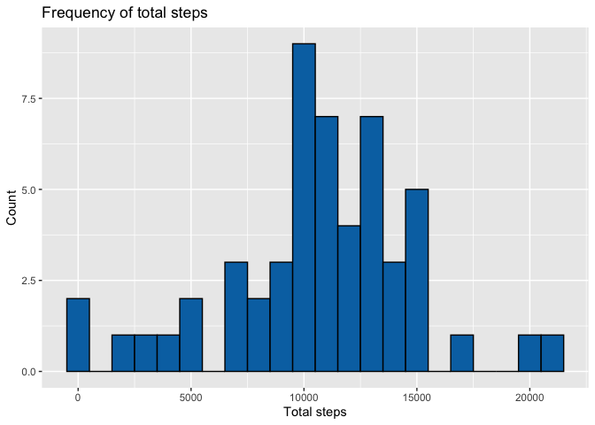
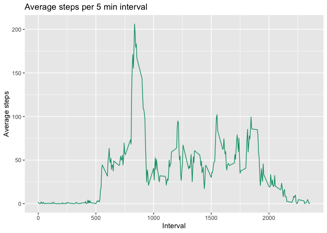
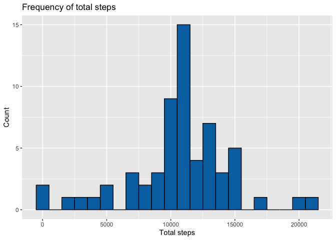
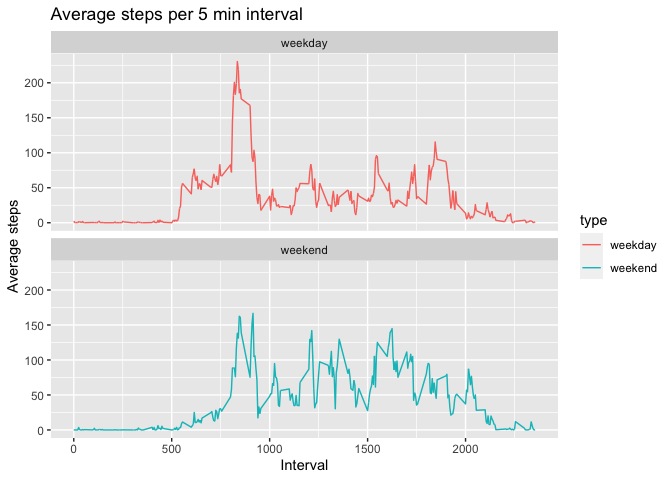

## Loading and preprocessing the data
The raw data is included in the *activity.zip* file.  
  
Load the raw data into a data.frame and use the lubridate package to format the date column to the appropriate class  

```r
library(lubridate)

data <- read.csv(unzip('./activity.zip'))
data$date <- ymd(data$date)
str(data)
```

```
## 'data.frame':	17568 obs. of  3 variables:
##  $ steps   : int  NA NA NA NA NA NA NA NA NA NA ...
##  $ date    : Date, format: "2012-10-01" "2012-10-01" ...
##  $ interval: int  0 5 10 15 20 25 30 35 40 45 ...
```


## What is mean total number of steps taken per day?
Calculate the total number of steps taken per date (ignoring missing values) 

```r
library(dplyr)

stepsPerDay <- data %>%
  na.omit() %>%
  group_by(date) %>%
  summarize(steps = sum(steps))
  
stepsPerDay
```

```
## # A tibble: 53 x 2
##    date       steps
##    <date>     <int>
##  1 2012-10-02   126
##  2 2012-10-03 11352
##  3 2012-10-04 12116
##  4 2012-10-05 13294
##  5 2012-10-06 15420
##  6 2012-10-07 11015
##  7 2012-10-09 12811
##  8 2012-10-10  9900
##  9 2012-10-11 10304
## 10 2012-10-12 17382
## # … with 43 more rows
```

Plot the total steps each as a histogram using ggplot2  

```r
library(ggplot2)

g <- ggplot(data=stepsPerDay, aes(steps)) + 
  geom_histogram(binwidth=1000, fill="#0072B2", color="black") + 
  labs(x="Total steps", y="Count", title="Frequency of total steps")
g
```

<!-- -->

Calculate the mean and median of the total steps taken per day  

```r
meanStepsPerDay <- mean(stepsPerDay$steps)
medianStepsPerDay <- median(stepsPerDay$steps)
```
- The mean of the total number of steps taken per day is **10766.19**
- The median of the total number of steps taken per day is **10765**  


## What is the average daily activity pattern?
Calculate the average steps taken across each day on each 5 min interval (ignoring missing values)

```r
stepsPerInterval <- data %>%
  na.omit() %>%
  group_by(interval) %>%
  summarize(averageSteps = mean(steps))

stepsPerInterval  
```

```
## # A tibble: 288 x 2
##    interval averageSteps
##       <int>        <dbl>
##  1        0       1.72  
##  2        5       0.340 
##  3       10       0.132 
##  4       15       0.151 
##  5       20       0.0755
##  6       25       2.09  
##  7       30       0.528 
##  8       35       0.868 
##  9       40       0     
## 10       45       1.47  
## # … with 278 more rows
```

Plot the data in a time series plot

```r
g <- ggplot(data = stepsPerInterval, aes(x=interval, y=averageSteps)) + 
  geom_line(color="#009E73") + 
  labs(x="Interval", y="Average steps", title="Average steps per 5 min interval")
g
```

<!-- -->

Find the 5 min interval with the highest average step count across all days

```r
maxAverageSteps <- stepsPerInterval$averageSteps[which.max(stepsPerInterval$averageSteps)]
maxInterval <- stepsPerInterval$interval[which.max(stepsPerInterval$averageSteps)]
```

The interval with ID **835** had the maximum average number of steps at **206.1698**  


## Imputing missing values

```r
numIncompleteObservations <- sum(!complete.cases(data))
```
There are **2304** rows with NAs
  
Create a new dataset use the mean for the 5 min interval across all the dates to fill missing values.

```r
# function to get the the mean steps for a given interval ID
meanForInterval <- function(intervalId) {
  filter(stepsPerInterval, interval == intervalId)$averageSteps
}

data2 <- data %>%
  group_by(date) %>%
  mutate(steps = ifelse(is.na(steps), meanForInterval(interval), steps))
```
  
Calculate the total number of steps taken each day and plot a histogram

```r
stepsPerDay2 <- data2 %>%
  group_by(date) %>%
  summarize(steps = sum(steps))

g <- ggplot(data = stepsPerDay2, aes(x=steps)) + 
  geom_histogram(binwidth=1000, fill="#0072B2", color="black") + 
  labs(x="Total steps", y="Count", title="Frequency of total steps")
g
```

<!-- -->

Calculate the mean and median steps per day

```r
meanStepsPerDay2 <- mean(stepsPerDay2$steps)
medianStepsPerDay2 <- median(stepsPerDay2$steps)
```
- The mean of the total number of steps taken per day is **10766.19**
- The median of the total number of steps taken per day is **10766.19**  
Imputing missing values has not greatly impacted the mean and median of the data set. The frequency of total steps has changes/increased as a result of imputing missing values.  


## Are there differences in activity patterns between weekdays and weekends?
Add a type factor with labels 'weekday' and 'weekend' to the imputed dataset

```r
data2 <- data2 %>%
  mutate(type = ifelse(wday(date, label=TRUE) %in% c('Sat','Sun'), 'weekend', 'weekday'))
data2$type <- as.factor(data2$type)
```

Plot timeseries plots showing the average steps per interval across the types of days (weekday vs weekend)

```r
stepsPerInterval2 <- data2 %>%
  group_by(type, interval) %>%
  mutate(averageSteps = mean(steps))

g <- ggplot(data=stepsPerInterval2,aes(x=stepsPerInterval2$interval, y=stepsPerInterval2$averageSteps, color=type)) +
  geom_line() + 
  labs(x="Interval", y="Average steps", title="Average steps per 5 min interval") + 
  facet_wrap(~ type, nrow = 2, ncol=1)
g
```

<!-- -->
